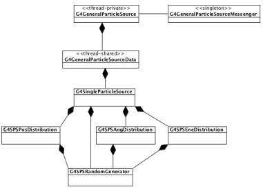

# Getting started

## Main program

Geant non fornisce un metodo main standard ma tipicamente questo contiene 2 classi toolkit e 3 classi (derivate dalle toolkit):

- G4RunManager:

  E' l'unica classe manager che va instanziata manualmente nel main. Controlla il flow del programma (**alla fine del programma va eliminato il puntatore al runManager. Questo distruggerà anche tutti gli altri elementi**)

  ```cpp
  #include "G4RunManagerFactory.hh"
  auto runManager = G4RunManagerFactory::CreateRunManager();
  //La versione multithreading si ottiene settando la env var G4RUN_MANAGER_TYPE su MT
  ```

  Quando il run manager viene creato vengono creati anche gli altri manager.

- ExG4DetectorConstruction01

  ```cpp
  runManager->SetUserInitialization(new ExG4DetectorConstruction01);
  ```

  Questa classe è una classe **definita dall'utente** che **deriva da G4VUserDetectorConstruction** che descrive il setup del detector (feometria, materiali, zone sensibili e readout)

- ExG4PhysicsList00

  ```cpp
  runManager->SetUserInitialization(new ExG4PhysicsList00);
  ```

  Classe definita dall'utente che **deriva da G4VUserPhysicsList** in cui vengono definite le particelle e i processi da simulare

- ExG4ActionInitialization01:

  ```cpp
  runManager->SetUserInitialization(new ExG4ActionInitialization01);
  ```

  Classe definita dall'utente che deriva da **G4VUserActionInitialization** in cui sono definite le user action classes che sono chiamate nella simulazioni e una azione obbligatoria che definisce le particelle principali.
  Questa classe fornisce il metodo GeneratePrimaries() che sarà chiamato all'inizio di ogni evento

> Dopo aver definito queste cose il run manager va inizializzato
>
> ```cpp
> runManager->Initialize();
> ```

- G4UImanager

  Il run manager crea anche l'UI. Per poter dare comandi all'UI bisogna ritornare un puntatore all'UI e poi usare il metodo **applyCommand()**

  ```cpp
  // get the pointer to the UI manager and set verbosities (comandi per verbose)
  G4UImanager* UI = G4UImanager::GetUIpointer();
  UI->ApplyCommand("/run/verbose 1");
  UI->ApplyCommand("/event/verbose 1");
  UI->ApplyCommand("/tracking/verbose 1");
  ```

  

Per runnare N processi basta usare il metodo **beamOn**

```cpp
runManager->beamOn(N);
```

## User classes

Ci sono due tipi di user class:

- **User initialization classes:**Sono le 3 già viste e sono obbligatorie. (Ma la action class deve includere anche una user action class derivata da G4VUserPrimaryGeneratorAction)
- **User action classes**:  Le user action class vanno definite nella classe G4VUserActionInitialization.
  Geant forniscce 5 classi hook addizionali che permettono di specificare procedure durante la simulazione:
  - G4UserRunAction 
  - G4UserEventAction 
  - G4UserStackingAction 
  - G4UserTrackingAction
  - G4UserSteppingAction

#### G4cout

G4cout e G4cerr sono oggetti iostream. Usarli sempre al posto di cout e cerr

## Detector Geometry

Ogni volume è creato descrivendo la forma e le sue caratteristiche fisiche e poi è messo all'interno di un volume conenitore (che specifica anche il sistema di riferimento)

Per descrivere la forma del volume si usa l'oggetto **solid**

- **World volume**: (solitamente un box)deve contenere con un certo margine tutti i volumi del detector 

- **Logical volume**: descrive tutte le proprietà di un volume (shape del solid, materiale, campo magnetico, detector,etc.)

  ```cpp
  //sintassi
  G4LogicalVolume nome = new G4LogicalVolume(solid_object,material,"logic_name")
  ```

  

- **Physical volume** Serve a descrivere la posizione di un volume. Crea una copia del volume logico e lo piazza all'interno di un volume più grande (*Per la sintassi vedi l'esempio sotto*)

Riassumendo, per creare un volume bisogna creare un solido, creare un volume logico usando il solido  creato e aggiungendo proprietà, creare un volume fisico per piazzarlo in un altro volume (o nel world)

**Esempio** (creo un world box e ci metto dentro umn cilindro)

```cpp
//("nome", dimensioni). Le dimensione sono i semilati

//Creo world
G4Box* worldBox
= new G4Box("World", world_hx, world_hy, world_hz);
//(solid,material,"nome_logical_volume")
G4LogicalVolume* worldLog
= new G4LogicalVolume(worldBox, Ar, "World");

//creo il solido
G4Tubs* trackerTube= new G4Tubs("Tracker",innerRadius,outerRadius,hz,startAngle,spanningAngle);
//Creo il volume logico
G4LogicalVolume* trackerLog
= new G4LogicalVolume(trackerTube, Al, "Tracker");

//Creo volume fisico per piazzare il detector 
G4VPhysicalVolume* trackerPhys=new G4PVPlacement(
    0, // no rotation
    G4ThreeVector(pos_x, pos_y, pos_z),// translation position
    trackerLog, // its logical volume
    "Tracker", // its name
    worldLog, // its mother (logical) volume
    false, // no boolean operations
    0, // its copy number
	true); //OPTIONAL: Check for overlapping (default false). Conviene metterlo
```

## Definire materiale

Si possono definire nuovi materiali o misture usando G4Element per poi poter costruire un G4Material. 

```cpp
//definizione acqua
G4double z, a, density;
G4String name, symbol;
G4int ncomponents, natoms;
a = 1.01*g/mole;
G4Element* elH = new G4Element(name="Hydrogen",symbol="H" , z= 1., a);
a = 16.00*g/mole;
G4Element* elO = new G4Element(name="Oxygen"
 ,symbol="O" , z= 8., a);
density = 1.000*g/cm3;
G4Material* H2O = new G4Material(name="Water",density,ncomponents=2);
H2O->AddElement(elH, natoms=2);
H2O->AddElement(elO, natoms=1);
```


Per definire un materiale va istanziato un oggetto (puntatore) G4Material. Si possono usare i dati del database del NIST. Per farlo possiamo usare il G4NistManager

```cpp
G4NistManager* man=G4NistManager::Istance();
G4Material* Air = man->FindOrBuildMaterial("G4_AIR");
```


## Definizione delle particelle

L'utente deve creare una classe derivata da G4VUserPhysicsList e implementare i metodi ConstructParticle() e ConstructProcess() (e opzionalmente anche SetCuts() per settare un range sulle particelle)

In geant ogni particella è rappresentata da una sua classe che deriva da **G4ParticleDefinition** (tranne per gli ioni pesanti G4Ions).
La particelle sono divise in 6 categorie: leptoni, mesoni, baryoni, bosoni, shortlived e ioni.

G4ParticlePropertyTable è usata per caricare le proprietà di G4ParticleDefinition in/da G4ParticlePropertyData

Ogni particle class rappresenta un tipo di particella e ogni classe ha un singolo oggetto a cui si può avere accesso tramite uno static method della classe (ma ci sono alcune eccezioni).

L'oggetto unico per ogni particle class è creato quando il suo static method è chiamato la prima volta per ritornare il puntatore

**Le particelle sono oggetti dicamici e devono essere istanziate prima dei peocessi fisici. Bisogna esplicitamente invocare gli static methods di tutte le particelle al momento dell'inizializzazione**

Gli static method di ogni particella vanno chiamati nel metodo ConstructParticle()

```cpp
void MyPhysicsList::ConstructParticle(){
    G4Proton::ProtonDefinition();
}
```

Volendo si può istanziare un intera categoria di partiecelle, ad esempio per costruire tutti i leptoni

```cpp
void ExN05PhysicsList::ConstructLeptons()
{
// Construct all leptons
G4LeptonConstructor pConstructor;
pConstructor.ConstructParticle();
}
```

### Cuts (???)

Per evitare alcune divergenze infrarosse alcuni processi EM richiedono una soglia sotto il quale non viene generata nessuna particella secondaria. Questa threshold può essere definita dalla distanza, energia ,etc.

La threshold di produzione va definita nel metodo SetCuts() della classe  G4VUserPhysicsList. Il valore di range cut è convertito in energia di threshold per ogni materiale e particella. In questo modo il una particella avente l'energia di threshold viene stoppata dopo aver viaggiato la distanza di range cut

## Processi fisici

Descrivono come le particelle interagiscono con i materiali. Tutti i processi derivano da G4VProcess e sono dotati dei metodi 

AtRestDoIt, • AlongStepDoIt, and • PostStepDoIt and the corresponding methods • AtRestGetPhysicalInteractionLength, • AlongStepGetPhysicalInteractionLength, and • PostStepGetPhysicalInteractionLength

Un oggetto di G4ProcessManager è associato a ogni particella ed è attaccato alla classe G4ParticleDefinition

La classe G4VUserPhysicsList crea e attacca un oggetto G4ProcessManager a tutte le particelle definite nel metodo ConstructParticles().

Per **specificare i processi** bisogna creare una classe derivata da G4VUserPhysicsList e implementare il metodo ConstructProcess() 

Il metodo AddTransportation() è obbligatorio per mostrare la traccia della particella

In ConstructProcess il processi fisici devono essere creati e registrati per ogni instanza di ogni particella. 

Per facilitare questo task è possibile usare il G4PhysicsListHelper. In questo modo è possibile ignorare il tipo di processo (AtRest,Driscrete,Continue, etc.) e l'ordine dei parametri

```cpp
void MyPhysicsList::ConstructProcess()
{
// Define transportation process
    AddTransportation();
	ConstructEM();
}
//Esempio processi per il gamma
void MyPhysicsList::ConstructEM()
{
// Get pointer to G4PhysicsListHelper
G4PhysicsListHelper* ph = G4PhysicsListHelper::GetPhysicsListHelper();
// Get pointer to gamma
G4ParticleDefinition* particle = G4Gamma::GammaDefinition();
// Construct and register processes for gamma
ph->RegisterProcess(new G4PhotoElectricEffect(), particle);
ph->RegisterProcess(new G4ComptonScattering(), particle);
ph->RegisterProcess(new G4GammaConversion(), particle);
ph->RegisterProcess(new G4RayleighScattering(), particle);
}
```

**NB esistono delle classi come G4EmStandardPhysics che forniscono intere physics list e possono evitare tutte queste definizioni **

Una cosa più semplice da fare è usare la classe G4VModularPhysicsList

```cpp
//MyPhysicsList è una classe che deriva da G4VPhysicsConstructor
class MyPhysicsList : public G4VModularPhysicsList
{// EM Physics
    public:
    MyPhysicsLis(){
        RegisterPhysics( new G4EmStandardPhysics(ver) );
		// Decays
		RegisterPhysics( new G4DecayPhysics(ver) );
    }
}
```

## Generare evento primario

Bisogna specificare come l'evento primario deve essere generato. Per farlo bisogna creare una classe che deriva da G4VUserPrimaryGeneratorAction.

```cpp
//////////////////////////////////
// ExG4PrimaryGeneratorAction01.hh
//////////////////////////////////
#ifndef ExG4PrimaryGeneratorAction01_h
#define ExG4PrimaryGeneratorAction01_h 1
#include "G4VUserPrimaryGeneratorAction.hh"
#include "G4ThreeVector.hh"
#include "globals.hh"

class G4ParticleGun;
class G4Event;
class ExG4PrimaryGeneratorAction01 : public G4VUserPrimaryGeneratorAction
{
    public:
        ExG4PrimaryGeneratorAction01(
            const G4String& particleName = "geantino",
            G4double energy = 1.*MeV,
            G4ThreeVector position= G4ThreeVector(0,0,0),
            G4ThreeVector momentumDirection = G4ThreeVector(0,0,1));
        ~ExG4PrimaryGeneratorAction01();
        // methods
        virtual void GeneratePrimaries(G4Event*);
    private:
        // data members
    	G4ParticleGun* fParticleGun; //pointer a to G4 service class
};
#endif
```


```cpp
//////////////////////////////////
// ExG4PrimaryGeneratorAction01.cc
//////////////////////////////////
#include "ExG4PrimaryGeneratorAction01.hh"
#include "G4Event.hh"
#include "G4ParticleGun.hh"
#include "G4ParticleTable.hh"
#include "G4ParticleDefinition.hh"
//....oooOO0OOooo........oooOO0OOooo........oooOO0OOooo........oooOO0OOooo......
ExG4PrimaryGeneratorAction01::ExG4PrimaryGeneratorAction01(
    const G4String& particleName,
    G4double energy,
    G4ThreeVector position,
    G4ThreeVector momentumDirection)
	: G4VUserPrimaryGeneratorAction(),fParticleGun(0){
        G4int nofParticles = 1;
        fParticleGun = new G4ParticleGun(nofParticles);
        // default particle kinematic
        G4ParticleTable* particleTable = G4ParticleTable::GetParticleTable();
        G4ParticleDefinition* particle= particleTable->FindParticle(particleName);
        fParticleGun->SetParticleDefinition(particle);
        fParticleGun->SetParticleEnergy(energy);
        fParticleGun->SetParticlePosition(position);
        fParticleGun->SetParticleMomentumDirection(momentumDirection);
	}
//....oooOO0OOooo........oooOO0OOooo........oooOO0OOooo........oooOO0OOooo......

ExG4PrimaryGeneratorAction01::~ExG4PrimaryGeneratorAction01(){
	delete fParticleGun;
}
//....oooOO0OOooo........oooOO0OOooo........oooOO0OOooo........oooOO0OOooo......
void ExG4PrimaryGeneratorAction01::GeneratePrimaries(G4Event* anEvent){
    // this function is called at the beginning of event
    fParticleGun->GeneratePrimaryVertex(anEvent);
}
```

### G4ParticleGun 

E' un generatore fornito da Geant che genera una (o più) particella primaria con un dato momento o posizione. NON FORNISCE ALCUNA SORTA DI RANDOMIZZAZIONE

Per avere alcune variabili distribuite casualmente è possibile usare dei metodi di particlegun che vanno chiamati in generatePrimaries() prima di chiamare il GeneratePrimaryVertex

### G4GeneralParticleSource

Questa classe può sostituire la particlegun e fornisce metodi più sofisticate per controllare le caratteristiche della particella principale come il sampling spaziale, la distribuzione angolare, lo spettro, sorgenti multiple, etc.
Per il resto è usata esattamente come la particle gun e può essere configurata da command line o come macro



G4GeneralParticleSourceData è un singleton che fornisce l'accesso alla classe G4GeneralParticleSource.

G4GeneralParticleSourceData può avere istanze multiple della classe G4SingleParticleSource ognuna con distribuzione spaziale, angolare,etc. diversa

- **Position distribution:**

  Può essere definita a partire da una basic shape (solitamente un piano o un cerchio in 2D). 

- **Angular distribution:**

- **Energy distribution**

- **Biasing**

(Per capire meglio queste cose conviene guardare un esempio)

## Eseguire il programma

Il programma può essere eseguito in diversi modi:

- **Hard coded catch mode**: Semplicemente codice senza UI

- **Batch mode with macros**:è possibile creare delle macro (ovvero lista di comandi) e passarli all'UImanager

  ```cpp
  //read a macro file of commands
  G4UImanager* UI=G4UImanager::GetUIpointer();
  G4String command = "/control/execute ";
  G4String fileName = argv[1];
  UI->ApplyCommand(command+fileName);
  
  //In questo modo se si runna il file compilato example run1.mac verranno eseguiti tutti i comandi nella macro
  ```

  Un esempio di macro può essere

  ```cpp
  #
  # Macro file for myProgram
  #
  # set verbose level for this run
  #
  /run/verbose 2
  /event/verbose 0
  /tracking/verbose 1
  #
  # Set the initial kinematic and run 100 events
  # electron 1 GeV to the direction (1.,0.,0.)
  #
  /gun/particle e-
  /gun/energy 1 GeV
  /run/beamOn 100
  ```

  Questo è utile per rieseguire il programma multiple volte con parametri diversi senza ricompilare nulla

- **Interactive mode driven by command lines**

  Apre una sessione interattiva con un interprete in attesa di comandi. Utile per fare debugging

  ```cpp
  // Define UI terminal for interactive mode
  G4UIsession * session = new G4UIterminal;
  session->SessionStart();
  delete session;
  ```

  

- **Interactive mode via GUI**

  Per selezionare il tipo di sessione conviene usare G4UIExecutive

  ```cpp
  #include "G4UIExecutive.hh"
  G4UIExecutive* ui = new G4UIExecutive(argc, argv);
  ui->SessionStart();
  delete ui;
  ```

  Il tipo di sessione è definito dal parametro di G4UIExecutive dopo argc e argv O dalla variabile G4UI_USE_XX (dove xx può essere QT,etc.) O in ~/.g4session si può selezionare il tipo di sessione 
  Tipicamente di default seleziona Qt, se non trova nient' altro parte terminale csh

## Visualiazation

Per includere la visualizzazione bisogna creare una istanza di G4VisManager

```cpp
// Initialize visualization
G4VisManager* visManager = new G4VisExecutive;
visManager->Initialize();

delete visManager;
```

Tipicamente per gestire le opzioni di visualizzazione si usa una macro (negli esempi chiamata vis.mac). Guarda gli esempi per capire come funziona

Per avviare la visualizzazione con openGL usare il comando /vis/open OGL

```cpp
UImanager->ApplyCommand("/vis/open OGL");
```

> Può essere utile usare if(argc==1) 
>
> - argc è il numero di argomenti passati all'eseguibile +1
> - argv è un array contenente i parametri passati all'eseguibile (in argv[0] c'è l'eseguibile stesso)
>
> In questo modo è possibile avere un comportamento predefinito a meno che non si decida di passare manualmente un'altra macro

Altre comandi utili sono:

- /vis/drawVolume : Disegna i volumi definiti