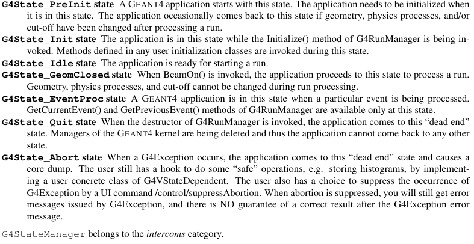

# Getting started

## Main program

Geant non fornisce un metodo main standard ma tipicamente questo contiene 2 classi toolkit e 3 classi (derivate dalle toolkit):

- G4RunManager:

  E' l'unica classe manager che va instanziata manualmente nel main. Controlla il flow del programma (**alla fine del programma va eliminato il puntatore al runManager. Questo distruggerà anche tutti gli altri elementi**)

  ```cpp
  #include "G4RunManagerFactory.hh"
  auto runManager = G4RunManagerFactory::CreateRunManager();
  //La versione multithreading si ottiene settando la env var G4RUN_MANAGER_TYPE su MT
  ```

  Quando il run manager viene creato vengono creati anche gli altri manager.

- ExG4DetectorConstruction01

  ```cpp
  runManager->SetUserInitialization(new ExG4DetectorConstruction01);
  ```

  Questa classe è una classe **definita dall'utente** che **deriva da G4VUserDetectorConstruction** che descrive il setup del detector (feometria, materiali, zone sensibili e readout)

- ExG4PhysicsList00

  ```cpp
  runManager->SetUserInitialization(new ExG4PhysicsList00);
  ```

  Classe definita dall'utente che **deriva da G4VUserPhysicsList** in cui vengono definite le particelle e i processi da simulare

- ExG4ActionInitialization01:

  ```cpp
  runManager->SetUserInitialization(new ExG4ActionInitialization01);
  ```

  Classe definita dall'utente che deriva da **G4VUserActionInitialization** in cui sono definite le user action classes che sono chiamate nella simulazioni e una azione obbligatoria che definisce le particelle principali.
  Questa classe fornisce il metodo GeneratePrimaries() che sarà chiamato all'inizio di ogni evento

> Dopo aver definito queste cose il run manager va inizializzato
>
> ```cpp
> runManager->Initialize();
> ```

- G4UImanager

  Il run manager crea anche l'UI. Per poter dare comandi all'UI bisogna ritornare un puntatore all'UI e poi usare il metodo **applyCommand()**

  ```cpp
  // get the pointer to the UI manager and set verbosities (comandi per verbose)
  G4UImanager* UI = G4UImanager::GetUIpointer();
  UI->ApplyCommand("/run/verbose 1");
  UI->ApplyCommand("/event/verbose 1");
  UI->ApplyCommand("/tracking/verbose 1");
  ```

  

Per runnare N processi basta usare il metodo **beamOn**

```cpp
runManager->beamOn(N);
```

## User classes

Ci sono due tipi di user class:

- **User initialization classes:**Sono le 3 già viste e sono obbligatorie. (Ma la action class deve includere anche una user action class derivata da G4VUserPrimaryGeneratorAction)
- **User action classes**:  Le user action class vanno definite nella classe G4VUserActionInitialization.
  Geant forniscce 5 classi hook addizionali che permettono di specificare procedure durante la simulazione:
  - G4UserRunAction 
  - G4UserEventAction 
  - G4UserStackingAction 
  - G4UserTrackingAction
  - G4UserSteppingAction

#### G4cout

G4cout e G4cerr sono oggetti iostream. Usarli sempre al posto di cout e cerr

## Detector Geometry

Ogni volume è creato descrivendo la forma e le sue caratteristiche fisiche e poi è messo all'interno di un volume conenitore (che specifica anche il sistema di riferimento)

Per descrivere la forma del volume si usa l'oggetto **solid**

- **World volume**: (solitamente un box)deve contenere con un certo margine tutti i volumi del detector 

- **Logical volume**: descrive tutte le proprietà di un volume (shape del solid, materiale, campo magnetico, detector,etc.)

  ```cpp
  //sintassi
  G4LogicalVolume nome = new G4LogicalVolume(solid_object,material,"logic_name")
  ```

  

- **Physical volume** Serve a descrivere la posizione di un volume. Crea una copia del volume logico e lo piazza all'interno di un volume più grande (*Per la sintassi vedi l'esempio sotto*)

Riassumendo, per creare un volume bisogna creare un solido, creare un volume logico usando il solido  creato e aggiungendo proprietà, creare un volume fisico per piazzarlo in un altro volume (o nel world)

**Esempio** (creo un world box e ci metto dentro umn cilindro)

```cpp
//("nome", dimensioni). Le dimensione sono i semilati

//Creo world
G4Box* worldBox
= new G4Box("World", world_hx, world_hy, world_hz);
//(solid,material,"nome_logical_volume")
G4LogicalVolume* worldLog
= new G4LogicalVolume(worldBox, Ar, "World");

//creo il solido
G4Tubs* trackerTube= new G4Tubs("Tracker",innerRadius,outerRadius,hz,startAngle,spanningAngle);
//Creo il volume logico
G4LogicalVolume* trackerLog
= new G4LogicalVolume(trackerTube, Al, "Tracker");

//Creo volume fisico per piazzare il detector 
G4VPhysicalVolume* trackerPhys=new G4PVPlacement(
    0, // no rotation
    G4ThreeVector(pos_x, pos_y, pos_z),// translation position
    trackerLog, // its logical volume
    "Tracker", // its name
    worldLog, // its mother (logical) volume
    false, // no boolean operations
    0, // its copy number
	true); //OPTIONAL: Check for overlapping (default false). Conviene metterlo
```

## Definire materiale

Si possono definire nuovi materiali o misture usando G4Element per poi poter costruire un G4Material. 

```cpp
//definizione acqua
G4double z, a, density;
G4String name, symbol;
G4int ncomponents, natoms;
a = 1.01*g/mole;
G4Element* elH = new G4Element(name="Hydrogen",symbol="H" , z= 1., a);
a = 16.00*g/mole;
G4Element* elO = new G4Element(name="Oxygen"
 ,symbol="O" , z= 8., a);
density = 1.000*g/cm3;
G4Material* H2O = new G4Material(name="Water",density,ncomponents=2);
H2O->AddElement(elH, natoms=2);
H2O->AddElement(elO, natoms=1);
```


Per definire un materiale va istanziato un oggetto (puntatore) G4Material. Si possono usare i dati del database del NIST. Per farlo possiamo usare il G4NistManager

```cpp
G4NistManager* man=G4NistManager::Istance();
G4Material* Air = man->FindOrBuildMaterial("G4_AIR");
```


## Definizione delle particelle

L'utente deve creare una classe derivata da G4VUserPhysicsList e implementare i metodi ConstructParticle() e ConstructProcess() (e opzionalmente anche SetCuts() per settare un range sulle particelle)

In geant ogni particella è rappresentata da una sua classe che deriva da **G4ParticleDefinition** (tranne per gli ioni pesanti G4Ions).
La particelle sono divise in 6 categorie: leptoni, mesoni, baryoni, bosoni, shortlived e ioni.

G4ParticlePropertyTable è usata per caricare le proprietà di G4ParticleDefinition in/da G4ParticlePropertyData

Ogni particle class rappresenta un tipo di particella e ogni classe ha un singolo oggetto a cui si può avere accesso tramite uno static method della classe (ma ci sono alcune eccezioni).

L'oggetto unico per ogni particle class è creato quando il suo static method è chiamato la prima volta per ritornare il puntatore

**Le particelle sono oggetti dicamici e devono essere istanziate prima dei peocessi fisici. Bisogna esplicitamente invocare gli static methods di tutte le particelle al momento dell'inizializzazione**

Gli static method di ogni particella vanno chiamati nel metodo ConstructParticle()

```cpp
void MyPhysicsList::ConstructParticle(){
    G4Proton::ProtonDefinition();
}
```

Volendo si può istanziare un intera categoria di partiecelle, ad esempio per costruire tutti i leptoni

```cpp
void ExN05PhysicsList::ConstructLeptons()
{
// Construct all leptons
G4LeptonConstructor pConstructor;
pConstructor.ConstructParticle();
}
```

### Cuts (???)

Per evitare alcune divergenze infrarosse alcuni processi EM richiedono una soglia sotto il quale non viene generata nessuna particella secondaria. Questa threshold può essere definita dalla distanza, energia ,etc.

La threshold di produzione va definita nel metodo SetCuts() della classe  G4VUserPhysicsList. Il valore di range cut è convertito in energia di threshold per ogni materiale e particella. In questo modo il una particella avente l'energia di threshold viene stoppata dopo aver viaggiato la distanza di range cut

## Processi fisici

Descrivono come le particelle interagiscono con i materiali. Tutti i processi derivano da G4VProcess e sono dotati dei metodi 

AtRestDoIt, • AlongStepDoIt, and • PostStepDoIt and the corresponding methods • AtRestGetPhysicalInteractionLength, • AlongStepGetPhysicalInteractionLength, and • PostStepGetPhysicalInteractionLength

Un oggetto di G4ProcessManager è associato a ogni particella ed è attaccato alla classe G4ParticleDefinition

La classe G4VUserPhysicsList crea e attacca un oggetto G4ProcessManager a tutte le particelle definite nel metodo ConstructParticles().

Per **specificare i processi** bisogna creare una classe derivata da G4VUserPhysicsList e implementare il metodo ConstructProcess() 

Il metodo AddTransportation() è obbligatorio per mostrare la traccia della particella

In ConstructProcess il processi fisici devono essere creati e registrati per ogni instanza di ogni particella. 

Per facilitare questo task è possibile usare il G4PhysicsListHelper. In questo modo è possibile ignorare il tipo di processo (AtRest,Driscrete,Continue, etc.) e l'ordine dei parametri

```cpp
void MyPhysicsList::ConstructProcess()
{
// Define transportation process
    AddTransportation();
	ConstructEM();
}
//Esempio processi per il gamma
void MyPhysicsList::ConstructEM()
{
// Get pointer to G4PhysicsListHelper
G4PhysicsListHelper* ph = G4PhysicsListHelper::GetPhysicsListHelper();
// Get pointer to gamma
G4ParticleDefinition* particle = G4Gamma::GammaDefinition();
// Construct and register processes for gamma
ph->RegisterProcess(new G4PhotoElectricEffect(), particle);
ph->RegisterProcess(new G4ComptonScattering(), particle);
ph->RegisterProcess(new G4GammaConversion(), particle);
ph->RegisterProcess(new G4RayleighScattering(), particle);
}
```

**NB esistono delle classi come G4EmStandardPhysics che forniscono intere physics list e possono evitare tutte queste definizioni **

Una cosa più semplice da fare è usare la classe G4VModularPhysicsList

```cpp
//MyPhysicsList è una classe che deriva da G4VPhysicsConstructor
class MyPhysicsList : public G4VModularPhysicsList
{// EM Physics
    public:
    MyPhysicsLis(){
        RegisterPhysics( new G4EmStandardPhysics(ver) );
		// Decays
		RegisterPhysics( new G4DecayPhysics(ver) );
    }
}
```

## Generare evento primario

Bisogna specificare come l'evento primario deve essere generato. Per farlo bisogna creare una classe che deriva da G4VUserPrimaryGeneratorAction.

```cpp
//////////////////////////////////
// ExG4PrimaryGeneratorAction01.hh
//////////////////////////////////
#ifndef ExG4PrimaryGeneratorAction01_h
#define ExG4PrimaryGeneratorAction01_h 1
#include "G4VUserPrimaryGeneratorAction.hh"
#include "G4ThreeVector.hh"
#include "globals.hh"

class G4ParticleGun;
class G4Event;
class ExG4PrimaryGeneratorAction01 : public G4VUserPrimaryGeneratorAction
{
    public:
        ExG4PrimaryGeneratorAction01(
            const G4String& particleName = "geantino",
            G4double energy = 1.*MeV,
            G4ThreeVector position= G4ThreeVector(0,0,0),
            G4ThreeVector momentumDirection = G4ThreeVector(0,0,1));
        ~ExG4PrimaryGeneratorAction01();
        // methods
        virtual void GeneratePrimaries(G4Event*);
    private:
        // data members
    	G4ParticleGun* fParticleGun; //pointer a to G4 service class
};
#endif
```


```cpp
//////////////////////////////////
// ExG4PrimaryGeneratorAction01.cc
//////////////////////////////////
#include "ExG4PrimaryGeneratorAction01.hh"
#include "G4Event.hh"
#include "G4ParticleGun.hh"
#include "G4ParticleTable.hh"
#include "G4ParticleDefinition.hh"
//....oooOO0OOooo........oooOO0OOooo........oooOO0OOooo........oooOO0OOooo......
//costruttore del generatore. DEfinizione e settaggi della particle gun
ExG4PrimaryGeneratorAction01::ExG4PrimaryGeneratorAction01(
    const G4String& particleName,
    G4double energy,
    G4ThreeVector position,
    G4ThreeVector momentumDirection)
	: G4VUserPrimaryGeneratorAction(),fParticleGun(0){
        G4int nofParticles = 1;
        fParticleGun = new G4ParticleGun(nofParticles);
        // default particle kinematic
        G4ParticleTable* particleTable = G4ParticleTable::GetParticleTable();
        G4ParticleDefinition* particle= particleTable->FindParticle(particleName);
        fParticleGun->SetParticleDefinition(particle);
        fParticleGun->SetParticleEnergy(energy);
        fParticleGun->SetParticlePosition(position);
        fParticleGun->SetParticleMomentumDirection(momentumDirection);
	}
//....oooOO0OOooo........oooOO0OOooo........oooOO0OOooo........oooOO0OOooo......

//Distruttore deve deallocare la particle gun
ExG4PrimaryGeneratorAction01::~ExG4PrimaryGeneratorAction01(){
	delete fParticleGun;
}
//....oooOO0OOooo........oooOO0OOooo........oooOO0OOooo........oooOO0OOooo......

//Generate primaries deve usare la article gun per generare la partice
void ExG4PrimaryGeneratorAction01::GeneratePrimaries(G4Event* anEvent){
    // this function is called at the beginning of event
    fParticleGun->GeneratePrimaryVertex(anEvent);
}
```

### G4ParticleGun 

E' un generatore fornito da Geant che genera una (o più) particella primaria con un dato momento o posizione. NON FORNISCE ALCUNA SORTA DI RANDOMIZZAZIONE

Per avere alcune variabili distribuite casualmente è possibile usare dei metodi di particlegun che vanno chiamati in generatePrimaries() prima di chiamare il GeneratePrimaryVertex

### G4GeneralParticleSource

Questa classe può sostituire la particlegun e fornisce metodi più sofisticate per controllare le caratteristiche della particella principale come il sampling spaziale, la distribuzione angolare, lo spettro, sorgenti multiple, etc.
Per il resto è usata esattamente come la particle gun e può essere configurata da command line o come macro


G4GeneralParticleSourceData è un singleton che fornisce l'accesso alla classe G4GeneralParticleSource.

G4GeneralParticleSourceData può avere istanze multiple della classe G4SingleParticleSource ognuna con distribuzione spaziale, angolare,etc. diversa

- **Position distribution:**

  Può essere definita a partire da una basic shape (solitamente un piano o un cerchio in 2D). 

- **Angular distribution:**

- **Energy distribution**

- **Biasing**

(Per capire meglio queste cose conviene guardare un esempio)

## Eseguire il programma

Il programma può essere eseguito in diversi modi:

- **Hard coded catch mode**: Semplicemente codice senza UI

- **Batch mode with macros**:è possibile creare delle macro (ovvero lista di comandi) e passarli all'UImanager

  ```cpp
  //read a macro file of commands
  G4UImanager* UI=G4UImanager::GetUIpointer();
  G4String command = "/control/execute ";
  G4String fileName = argv[1];
  UI->ApplyCommand(command+fileName);
  
  //In questo modo se si runna il file compilato example run1.mac verranno eseguiti tutti i comandi nella macro
  ```

  Un esempio di macro può essere

  ```
  #
  # Macro file for myProgram
  #
  # set verbose level for this run
  #
  /run/verbose 2
  /event/verbose 0
  /tracking/verbose 1
  #
  # Set the initial kinematic and run 100 events
  # electron 1 GeV to the direction (1.,0.,0.)
  #
  /gun/particle e-
  /gun/energy 1 GeV
  /run/beamOn 100
  ```

  Questo è utile per rieseguire il programma multiple volte con parametri diversi senza ricompilare nulla

- **Interactive mode driven by command lines**

  Apre una sessione interattiva con un interprete in attesa di comandi. Utile per fare debugging

  ```cpp
  // Define UI terminal for interactive mode
  G4UIsession * session = new G4UIterminal;
  session->SessionStart();
  delete session;
  ```

  

- **Interactive mode via GUI**

  Per selezionare il tipo di sessione conviene usare G4UIExecutive

  ```cpp
  #include "G4UIExecutive.hh"
  G4UIExecutive* ui = new G4UIExecutive(argc, argv);
  ui->SessionStart();
  delete ui;
  ```

  Il tipo di sessione è definito dal parametro di G4UIExecutive dopo argc e argv O dalla variabile G4UI_USE_XX (dove xx può essere QT,etc.) O in ~/.g4session si può selezionare il tipo di sessione 
  Tipicamente di default seleziona Qt, se non trova nient' altro parte terminale csh

## Visualiazation

Per includere la visualizzazione bisogna creare una istanza di G4VisManager

```cpp
// Initialize visualization
G4VisManager* visManager = new G4VisExecutive;
visManager->Initialize();

delete visManager;
```

Tipicamente per gestire le opzioni di visualizzazione si usa una macro (negli esempi chiamata vis.mac). Guarda gli esempi per capire come funziona

Per avviare la visualizzazione con openGL usare il comando /vis/open OGL

```cpp
UImanager->ApplyCommand("/vis/open OGL");
```

> Può essere utile usare if(argc==1) 
>
> - argc è il numero di argomenti passati all'eseguibile +1
> - argv è un array contenente i parametri passati all'eseguibile (in argv[0] c'è l'eseguibile stesso)
>
> In questo modo è possibile avere un comportamento predefinito a meno che non si decida di passare manualmente un'altra macro

Altre comandi utili sono:

- /vis/drawVolume : Disegna i volumi definiti

------

------

# Toolkit fundamentals

Brevemente il ruolo di ogni categoria di classi è:

- **Run and Event**: classi relative alla generazioni di eventi e particelle secondarie
- **Tracking and track**: classi relative alla propagazione delle particelle.Un processo fisico può eseguire delle azioni lungo la traccia (possono essere distribuite sia nello spazione che nel tempo)
- **Geometry and magnetic field**: definiscono la geometria dell'apparato e dei campi magnetici
- **Particle and material**: definiscono le particelle e i materiali in gioco
- **Physics** Definiscono tutti i processi fisici che verranno simulati. E' possibile selezionare modelli diversi per diversi energy range o materiali. Tramite data encapsulation e polimorfismo è possibile avere facilmente accesso alle cross sectio
- **Hits and digitization:** I volumi raggruppati sotto la categoria sensitive detector possono fornire il readout di un detector tramite le hit collection
- **Visualization**: si occupa delle visualizzazione di solidi, tracce e hit
- **Interfaces**: gestione della GUI

Geant integra dei tipi (es. G4int) che altro non sono che dei typedef ai tipi definiti nella STL o in CLHEP e sono definiti nell'header globals.hh

> **Unità**
>
> In SystemOfUnits.hh sono definite tutte le unità più utilizzate ma è possibile:
>
> - Definirne di nuove:
>   ```cpp
>   static const G4double inch = 2.54*cm
>   ```
>
> - Fare il cambio di unità in place
>   ```cpp
>   G4cout  << energy_in_mev/keV << G4endl;
>   ```

## Run

Una run consiste in una sequeza di eventi. All'interno di una run la geometria e i processi fisici non dovrebbero mai essere modificati

La run è rappresentata da *G4Run* (e gestito dal G4RunManager o G4MTRunManager in caso di multithreading) ed ha un numero identificativo settato dall'utente. G4Run ha 2 puntatori alle *G4VHitsCollection* e *G4VDigiCollection* che sono tavole associate ai sensitive detector e ai digitizer modules

G4Run ha due metodi virtuali (RecordEvent (come accumulare dati su singolo thread) e Merge(come mettere insieme i dati dei singoli thread)) che **vanno definiti in caso di multithreading** per specificare come accumulare i dati

### Geant come macchina a stati

Geant è disegnato come una macchina a stati: certi metodi sono disponibuli solo in alcuni stati.



Volendo l'utente può fare cose al momento di un cambio stato creando una classe che deriva da *G4VStateDepend* implementando il virtual methon Notify(G4ApplicationState requiredState) dove required state è lo stato corrente.

Anche il comportamente del RunManager può essere modificato sovrascrivendo i metodi di inizializzazione

## Event

Un oggetto event contiene tutti gli input e gli output simulati. E' costruita dal runmanager e mandata al *G4EventManager*

Un G4Event ha 4 tipi di informazione:

- **Particelle e vertici primari**
- **Traiettorie**: memorizzate in un G4TrajectoryContainer. In G4Event è memorizzato il puntatore
- **Hits collection**: COllezione degli hit generati nel sensitive detector e memorizzati in un oggetto G4HCofThisEvent (event ha il puntatore)
-  **Digits collections** Digit generati dal modulo digitizer

Il G4EventManager esegue le seguenti operazioni:


**BIASING EVENT:** E' possibile usare questa tecnica per diminuire notevolmente i tempi di calcolo nella simulazione di eventi rari. Consiste nel produrre molti più eventi rari rispetto al normale ma pesarli con dei pesi in modo da de-biasare la simulazione. (Applicazione estremamente specifica, vedi solo se serve)

# Detectors

## Solidi

I solidi possono essere uniti, intersecati o sottratti tramite operazioni booleane

```cpp
G4UnionSolid* union=new G4UnionSolid("Box+Cylinder", box, cyl);
G4IntersectionSolid* intersection=new G4IntersectionSolid("Box*Cylinder", box, cyl);
G4SubtractionSolid* subtraction=new G4SubtractionSolid("Box-Cylinder", box, cyl);
```

potrebbe essere utile, prima di fare queste operazioni, traslare o ruotare uno di questi solidi.

```cpp
G4RotationMatrix* yRot = new G4RotationMatrix;
 // Rotates X and Z axes only
yRot->rotateY(M_PI/4.*rad);
 // Rotates 45 degrees
G4ThreeVector zTrans(0, 0, 50);
G4UnionSolid* unionMoved =
new G4UnionSolid("Box+CylinderMoved", box, cyl, yRot, zTrans);
//La trasformazione viene applicata al secondo solido
```

Ci sono altri metodi per creare strutture multicomposite o tassellate ma sono casi specifici che non trattiamo qui

## Logical volumes

```cpp
G4LogicalVolume( G4VSolid* pSolid,
G4Material* pMaterial,
const G4String& Name,
G4FieldManager* pFieldMgr=0,
G4VSensitiveDetector* pSDetector=0,
G4UserLimits* pULimits=0,
G4bool Optimise=true )
```

Il volume logico gestisce anchele informazioni relative alla visualizzazione, campi EM e traccia.
E' possibile anche regolare la granularità dell'ottimizzazione della traccia usando il metodo SetSmartless (di default è 2) che controlla il numero medio di slice perper volume contenuto che è usato nell'ottimizzazione ù

## Subdetector

I volumi logici possono essere pensati come dei sub detector poichè rappresentano parti singole dell'intero detector. E' possibile assegrare dei *cut* a un volume logico in modo tale da runnare una simulazione più accurata solo dove richiesto. Per fare questo si usa il concetto di *detector Regior*

Una volta che la geometria è stata definita è possivile definire una region con
```cpp
// rName = identificatore (stringa) della detector region
G4Region( const G4String& rName )
G4Region* emCalorimeter = new G4Region("EM-Calorimeter");
emCalorimeterLV->SetRegion(emCalorimeter); //LV sta per logical volume.
emCalorimeter->AddRootLogicalVolume(emCalorimeterLV);
```

Usando SetRegion su un logical volume lo trasformiamo in un root logical volume che è il primo volume in cima alla gerarchia a cui è assenata la regione (le proprietà della regione sono passate anche a tutti i figli del volume logico selezionato)

Una volta definita la region è possibile definire una soglia di produzione (vedi più avanti cosa è un cut)
```cpp
emCalorimeter->SetProductionCuts(emCalCuts);// emCalCuts è un oggetto G4ProductionCut 
```

## Physical volume


```cpp
G4PVPlacement(G4Transform3D solidTransform, 
//in alternativa alla trasformazione è possibile passare
	//G4RotationMatrix*pRot,
	//const G4ThreeVector& tlate,
    G4LogicalVolume* pCurrentLogical,
    const G4String& pName,
    G4LogicalVolume* pMotherLogical,
    G4bool pMany, //lascialo false
    G4int pCopyNo,
    G4bool pSurfChk=false)//rallenta esecuzione ma conviene attivarlo
```

Si noti che se si usa la matrice di rotazione bisogna passare un puntatore quindi la matrice non viene copiata E NON VA MODIFICATA DOPO AVER CREATO IL VOLUME FISICO

### Repliche

E' possibile suddividere un volume logico in più parti ed è possibile farlo con le G4PVReplica


L'asse su cui si può replicare sono:

X,Y,X (kXAxis), asse radiale (kRho), asse polare cilindrico (kPhi)

L'importante è che il volume logico madre abbia un solo figlio ovvero la replica (poichè le repliche lo riempiono completamente). Si può usare una replica come madre di un'altra replica

Inoltre è necessario dimensionare opportunamente le dimensioni del solido con il numero di repliche e l'offset scelto

Per esempio per suddividere un parallelepipedo in una matrice

```cpp
G4Box *solidDetector = new G4Box("Detector",0.25*m,0.25*m,0.001*m);
G4LogicalVolume *logicDetector = new G4LogicalVolume(solidDetector,MyMaterials.Air,"Detector");
G4VPhysicalVolume *physDetector = new G4PVPlacement(0,G4ThreeVector(0.,0.,0.3*m),logicDetector,"Detector",logicWorld,false,0,true);

G4int nbOfPixelperAxis=20;
G4double pixelDim = (0.25/nbOfPixelperAxis)*m;
G4Box *solidPixel = new G4Box("Pixel",pixelDim,0.25*m,0.001*m);
G4LogicalVolume *logicPixel= new G4LogicalVolume(solidPixel,MyMaterials.Si,"Pixel");
G4VPhysicalVolume *physPixelX= new G4PVReplica ("PanelX",logicPixel,logicDetector,kXAxis,nbOfPixelperAxis,pixelDim*2,0);

G4Box *solidPixelY = new G4Box("Pixel",pixelDim,pixelDim,0.001*m);
G4LogicalVolume *logicPixelY= new G4LogicalVolume(solidPixelY,MyMaterials.Si,"Pixel");
G4VPhysicalVolume *physPixelY= new G4PVReplica ("PanelY",logicPixelY,logicPixel,kYAxis,nbOfPixelperAxis,pixelDim*2,0);
```

Questo consente di evitare dei cicli for con dentro dei placement MA è scomodo perchè non è chiaro come vengono settati i copy number

Se si vogliono fare cose più complicate come costruire ripetizioni di *volumi parametrizzati* (ovvero con proprietà diverse come ad esempio il materiali) è possibile usare G4VPVParametrisation e G4PVParametrised (vedi all'occorrenza) (risolvono anche il problema dei copy number)

## Campi EM

La propagazione delle particelle in un campo è simulato usando Runge-Kutta (ci sono diverse implementazioni e alternative)

Ci sono diversi parametri che regolano l'accuratezza della soluzione: uno dei principali è la **miss distance** ovvero il limite superiore alla sagitta

Per creare un campo magnetico bisogna creare un oggetto G4MagneticField (G4ElectricField per i campi elettrici e G4EqMagElectricField per quelli EM)

Ci sono diverse funzioni per farlo, la più semplice è campo magnetico uniforme (ci sono molte configurazioni come ad esempio quella di quadrupolo)

Il modo più conveniente per mettere un campo in un volume è quello di definire un G4FieldManager e passarlo al volume logico

```cpp
G4MagneticField *magField =new G4UniformMagField(G4ThreeVector(0.,0.,3.0*kilogauss));
G4FieldManager* localFieldMgr = new G4FieldManager(magField);
G4LogicalVolume *logicWorld = new G4LogicalVolume(solidWorld,MyMaterials.Air,"World",localFieldMgr);

```

Vedi il manuale se interessato a utilizzare altri solver per il calcolo delle traiettorie o per modificare l'accuratezza del  calcolo

**NB la precessione dello spin in campo magnetico non viene simulata automaticamente. Va fatta a mano, vedi manuale**

## HIT e sensitive detector

SUL MANUALE DI QUESTA ROBA NON SI CAPISCE NULLA, scrivo quello che ho imparato nella pratica

Per registrare i dati riguardanti alle tracce e alle interazioni delle particelle in un volume bisogna rendere il volume logico sensibile

Per fare questo bisogna fare 2 cose:

-  costruire una classe che deriva da **G4VSensitiveDetector**

  ```cpp
  class MySensitiveDetector : public G4VSensitiveDetector{
      public:
          MySensitiveDetector(G4String name);
          ~MySensitiveDetector();
      private:
          virtual G4bool ProcessHits(G4Step*, G4TouchableHistory*);
  ```

  Questa classe fornisce sia il costruttore del volumi sensibili sia il metodo **ProcessHits** che servirà a ottenere i dati che ci interessano dal nostro detector. La funzione processhits verrà eseguita ad ogni singolo step interno al detector sensibile

  Altri 2 metodi sono **Initialize e EndOfEvents** che invece vengono runnati all'inizio e alla fine di un **evento**

- Implementare il metodo privato **ConstructSDandField()** nella classe che costruisce il detector (quella che deriva da G4VUserDetectorConstruction).
   **NB: i volumi logici che diventeranno sensibili definiscili come private nell'header altrimenti non puoi usare il puntatore per settarlo sensibile**

  All'interno della funzione CostructSDandField() bisogna costruire e settare il volume sensibile con SetSensitiveDetector(logicVolume)

  ```cpp
  void MyDetectorConstruction::ConstructSDandField(){
      MySensitiveDetector *sensDet = new MySensitiveDetector("Sensitive");
      logicDetector->SetSensitiveDetector(sensDet);
      }//sensDet è il volume logico da rendere sensibile
  //logicDetector è definito nell'header di mydet.constr
  ```

> Le principali informazioni sono ottenibili dagli **Step, Touchable e Tracks**
>
> - **Step:** Corrisponde a un segmento di traiettoria. Uno step possiede 2 attributi G4StepPoint ovvro (un pre step point e un post step point) che contengono informazioni relative all'interazione prima e dopo lo step (usa sempre pre)
>
>   Inoltre dallo step è possibile otteneretutte le informazioni che ci servono sull'interazione
>
> - **Touchable**: Dal touchable invece possiamo avere tutte le informazioni sulla geometria e sul volume in cui è avvennuta l'unterazione
>
> - **Track**: Informazioni sulla particella
>
> - **Event**: insieme delle tracce (Le particelle vengono aggiunte come uno stack)

Un esempio di informazioni utili che possiamo ottenere in ProcessHits possiamo osserverlo in questo esempio

```cpp
G4bool MySensitiveDetector::ProcessHits(G4Step* aStep, G4TouchableHistory* R0hist){ //parametro TouchableHistory è obsoleto, lascialo stare
    
    //A ogni particella (quindi a ogni traccia) è associato un ID
    G4Track *track = aStep->GetTrack();
	G4int trackID = track->GetTrackID();
    G4String particleName = track->GetDefinition()->GetParticleName();//nome part.
    
    
    //id dell'evento
    G4int evID=G4RunManager::GetRunManager()->GetCurrentEvent()->GetEventID();//bisogna importare l'header del runmanager
    
    //Ottieni evento e Id dell'evento
    G4Event *ev= aStep -> GetEvent();
    G4int evID= ev->GetEventID();
    
    //E' possibile anche killare le tracce che non ci interessano
	if (trackID != 1 && particleName != "gamma"){
        track->SetTrackStatus(fStopAndKill);
    }
    
    //ottieni posizione spaziale dell'interazione
    G4StepPoint *preStepPoint = aStep -> GetPreStepPoint();
    G4ThreeVector prePos = preStepPoint->GetPosition();

	//Energia depositata
    G4double edep= aStep->GetTotalEnergyDeposit();
    
	//ritorna il touchable coinvolto nel punto di interazione
    const G4VTouchable* touchable = preStepPoint->GetTouchable();
    G4int copyNo = touchable->GetCopyNumber();//torna il copy number del volume toccato
    //Get Volume ritorna il volume fisico coinvolto, GetTranslation la posizione del suddetto volume fisico
    G4ThreeVector pos = (touchable->GetVolume())->GetTranslation();
}
```


## Salvare i risultati

Possiamo salvare i dati della simulazione in un file root in quanto geant è provvista della classe **G4VAnalysisManager** che non è altro che un wrapper interno a Root (in questo modo non dobbiamo scomodarci a importare altri file nel makefile)

Per salvare i dati dobbiamo creare una classe che eredita da **G4UserAction** e definire i metodi virtuali *BeginOfRunAction(const G4Run\*)* e *EndOfRunAction(const G4Run\*)* che verranno eseguiti rispettivamente all'inizio e alla fine di una run

- In *BeginOfRunAction(const G4Run\*)* dobbiamo:
  - Definire un analysis manager (singleton)
  - Aprire il file
  - Creare NTuple o quello che si vuole (comandi di root)
- In EndOfRunAction(...) bisogna scrivere e chiudere il file

```cpp
void MyRunAction::BeginOfRunAction(const G4Run*){
    //L'analysis manager, come tutto il resto, è un singleton.
    //Definirne uno nuovo torna solo il puntatore al manager già creato.
    // Per questo lo istanzio 20 volte, puntano tutti allo stesso manager
    G4AnalysisManager* analysisManager = G4AnalysisManager::Instance();
    analysisManager->SetVerboseLevel(2);
    analysisManager->OpenFile("output.root");


    analysisManager->CreateNtuple("ntuple", "ntuple");
    analysisManager->CreateNtupleDColumn("EnergyDeposites");//Ntupla per energia depos.
    analysisManager->FinishNtuple(0);

}


void MyRunAction::EndOfRunAction(const G4Run*){
    //Torna il puntatore al manager definito prima (singleton)
    G4AnalysisManager* analysisManager = G4AnalysisManager::Instance();
	//Scrivo e chiudo
    analysisManager->Write();
    analysisManager->CloseFile();

}
```

- Questa classe va importata ed eseguita nella funzione Build della classe che deriva da G4VUserActionInitialization

  ```cpp
  void MyActionInitialization::Build() const
  {
  //ALTRA ROBA (setting del generatore)
      MyRunAction* runAction = new MyRunAction(); //MyRunAction è la classse definita sopra
      SetUserAction(runAction);
  }
  ```

- In **ProcessHits** (dove avevamo ottenuto i dati che ci interessano per ogni step) dobbiamo fillare le NTuple (o altri oggetti) che abbiamo creato. Per farlo dobbiamo di nuovo ridefinire l'analysis manager che tornerà un puntatore a quello già definito prima

  ```cpp
  G4bool MySensitiveDetector::ProcessHits(G4Step* aStep, G4TouchableHistory* R0hist){
      //ALTRA ROBA ()
      G4AnalysisManager* analysisManager = G4AnalysisManager::Instance();
      analysisManager->FillNtupleDColumn( 0, edep/MeV);    
      return true;}
  ```

  


# ALTRO

- /run/verbose 2 permette di vedere anche l'utilizzo delle risorse di sistema
- /vis/scene/add/axes x y z lenght m permette di disegnare gli assi in un punto specifico e della dimensione voluta

# TODO

- Vedere come randomizzare energia, angolo e posizione della gui
- Vedere come salvare dati relativi alle tracce reali e gli hit (chiedere a rizzi di come fare i raw data soprattutto per i PS)
- Di solito si fa unit test su geant???
- Come tratto gli elettroni delta????
- devo stoppare le tracce? se si quando? (soprattutto relativi a elettroni delta)
- Chiedi se va bene: 
  Salvo traccia vera come posizione da dove è partito il fascio +  versore (3 vettori che hanno come componenti gli angoli sferici)
  In più salvo le posizioni dei centri dei pixel accesi
- Vedere questioni sul digitizer
- Dare un occhiata ad altri metodi usabili sugli oggetti usati nel processhits
- Vedere come usare il tempo nelle simulazioni (es. flusso di particelle o decadimenti di sorgenti)
- vedere definizione dei detector (e di quanto altro possibile) con file ascii esterni
- Vedi come generare particelle in posizioni e direzioni casuali
- Multithreating
- Video
- cuts (?)
- Le strip e i pixel hanno uno spacing? (zone morte)
- Singola o multiple tracce contemporaneamente nel detector?
- Come algoritmo di traccia va bene hough transform??? Anche in cuda