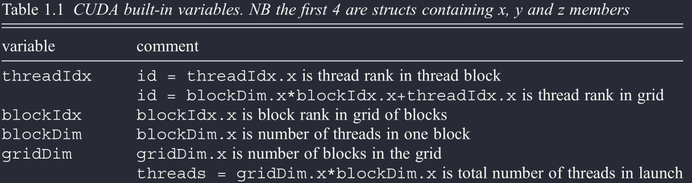

# GPU (graphic processing units)

Le GPU sono pensate per applicare un grande numeri di operazioni su dati indipendenti (SIMD, in realtà SIMT (single instruction multiple threads)).

Nelle GPU (soprattutto per le operazioni grafiche) la larghezza di banda (troughtput) è più importante della latenza ovvero il numero di operazioni eseguibili per unità di tempo è più importante del tempo necessario a completare una singola operazione.

Inoltre alcune operazioni semplici usate molto frequentemente possono essere implementate direttamente via hardware in modo tale da non richiedere diversi cicli di calcolo per eseguire

Nelle GPU la gestione della memoria è completamente manuale, è l'utente a decidere cosa spostare nella DRAM (global memory) della GPU e cosa nella cache (chiamata shared memory: molto piccola per aumentare il bandwidth (~TB/s)).
Ricorda che anche la lettura/scrittura della memoria sulle GPU avviene in parallelo, se i dati sono adiacenti è possibile leggerle tutte insieme

**SIMT:** I singoli cores nelle gpu sono organizzati in gruppi chiamati threads. Singolarmente ogni threads ha una architettura SIMD. Quindi possiamo fare eseguire operazioni diverse su dati diversi ma il numero di operazione è limitato dal numero di threads disponibili (se ne istanziamo più di quanto esistono semplicemente lo scheduler li farà runnare in maniera concorrente ) 

## GPU vs CPU

|                       CPU                        | GPU                                    |
| :----------------------------------------------: | -------------------------------------- |
|       + Memoria grande (sia RAM che cache)       | - Memoria piccola                      |
|           + Grandi frequenze di clock            | - Basse frequenze di clock             |
|          + ALU potente (bassa latenza)           | - Basse performance per singolo thread |
|                - Bassa bandwidth                 | + Alta bandawidth                      |
|             - Basse performance/Watt             | + Alte performance/Watt                |
| - La gestione automatica della cache ha un costo |                                        |

L'idea migliore è quella di usare le CPU per eseguire operazioni sequenziali e GPU per quelle parallele

## Architettura GPU

Tipicamente quando si programma una GPU il workflow è:

1. Copiare i dati sulla GPU
2. Copiare il Kernel (istruzioni)
3. Prendere i risultati e riportarli in RAM

I cores sono organizzati in sottostrutture: principalmente in thread, blocchi e griglie

- I thread sono i core di base. I thread sono dotati di un registro: una piccola memoria che consente di  salvare dati temporanei per consentire il processo di calcolo

- I thread sono organizzati in blocchi. Solo i thread appartenenti allo stesso blocco possono comunicare tra loro (hanno una shared memory tra loro condivisa). Un singolo blocco ha architettura SIMD: posso scegliere quanti thread runnare all'interno di un blocco ma tutti i thread eseguiranno le stesse istruzioni

- Le grid sono insiemi di blocchi. Su grid diverse possono runnare kernel differenti. All'interno della grid è contenuta la global memory condivisa con tutti i blocchi

  Ci sono altri tipi di memorie nella grid:

  - Constant memory: Memoria di sola lettura per i thread con accesso più veloce rispetto alla global memory
  - Texture and Surface memory: Memoria a latenza più bassa per leggere elementi adiacenti di un array

**QUESTA E' LA STRUTTURA DEL SOFTWARE**: I threads vengono eseguiti sui cores, i blocchi sui multiprocessori e le grid sull'intera gpu

| **NB:** Si potrebbe pensare che basta istanziare un numero di thread uguale a quello dei cores per ottenere il massimo delle prestazioni tenendo sempre occupata la GPU ma NON E' così.<br />Esistono nella GPU quelli che si chiamano resident threads ovvero thread che vengono istanziati in attesa di esecuzione ma non eseguiti. Istanziando un numero superiore di thread rispetto a quello dei cores si può sfruttare questi resident cores per ridurre i tempi di latenza dovuti alla copia della memoria tramite concorrenza |
| ------------------------------------------------------------ |

**Problemi:** Il trasferimento di dati sulla global memory della GPU è lento (overhead considerevole) però è possibile copiare i dati e eseguire istruzionio in parallelo.

Conviene usare le GPU solo quando l'overhead della copia in memoria è irrilevante rispetto ai tempi di calcolo. Inoltre conviene usare le GPU solo su alcune istruzioni e tenere il resto su CPU

### Coalescenza della memoria

La lettura della memoria nelle GPU è coalescente ovvero la memoria viene letta in burst (ovvero in pacchetti).

Se si riesce a tenere adiacenti i dati usati da thread adiacenti si può leggere di colpo e passare ai thread un intero burst di dati

### Direttive e librerie

Invece che programmare tutto in CUDA potrebbe essere più semplice usare librerie come OpenMP(preferibile per parallelismo su CPU o calcolo distribuito) o OpenACC(preferibile per GPU) dove basta usare delle direttive al preprocessore per mandare istruzioni e dati alla GPU (usato soprattuto su loopcon molte iterazioni e non troppi if). 

Hanno il vantaggio di essere molto semplici da utilizzare ma difficili da debuggare e non efficienti come CUDA (se scritto a modo)

Esistono anche numerose librerie per il calcolo su GPU come thrust o cuBLAS che si occupano autonomamente di eseguire operazioni matematiche complesse gestendo la gpu senza l'intervento manuale dell'utente

## CUDA

|  |
| :----------------------------------------------------------: |
| Variabili builtin di cuda che identificano i thread, blocchi, grid in esecuzione |

Ricorda che tutto ciò all'interno di un kernel non può essere roba proveniente dalla C++ standard library: quando programmi su GPU praticamente devi scrivere nella sintassi e nella logica del C oppure usare altre librerie come thrust (per esempio i std::vector possono essere rimpiazzati dai thrust/device_vector)

Se si vuole passare una classe C++ al kernel tutti i metodi della funzione devono avere una versione \_\_device\_\_

In CUDA ci sono alcune keyword da usare come prefissi alle funzioni che servono a dare istruzioni precise:

- \_\_host\_\_ :il compilatore compila una versione della funzione che funzioni anche su CPU  (necessaria solo se si vuole sia CPu che GPU)

- \_\_device\_\_: la funzione viene compilata per funzionare su GPU (si possono creare anche 2 versioni basta usare \_\_host\_\_  \_\_device\_\_ inline)

  (Si possono creare anche variabili o array C style che verranno allocati direttamente sulla GPU (es. \_\_device\_\_ int arr\[2\]\[2\]))

- inline: per le funzioni device la compilazione inline è di defult, nel caso volessimo anche la versione host dobbiamo manualmente generarla inline

E' possibile avere anche 2 funzioni totalmente diverse ma con lo stesso nome

- \_\_global\_\_ : questa keyword specifica che la funzione è un kernel da lanciare su gpu. La differenza con la keyword device è che un kernel global è chiamato da CPU e runna su GPU mentre una funzione device è chiamabile solo dalla GPU.
  **I kernel devono essere di tipo void e i suoi argomenti possono essere solo valori scalari o puntatori. Inoltre bisogna passare i dati a valori, non si possono usare le references (è anche logico visto che tutto va copiato sulla global memory della GPU)** (come ho già detto, con i kernel devi ragionare come in C)

 Per runnare un kernel basta chiamare il kernel nel seguente modo

```cpp
__global__ void kernel_name (){}

int main(){
    kernel_name<<<n,m>>>();
    cudaDeviceSynchronize();
    return 0;
}
```

In questo modo il kernel verrà runnato su m thread di n blocchi (quindi n x m volte in parallelo).
**Il kernel viene runnato in maniera asincrona rispetto alla GPU. Il comando cudaDeviceSynchronize() serve ad attendere il risultato dalla GPU**

**Questi valori (n e m) possono essere definiti a runtime**

> Per parallelizzare un loop tipicamente quello che si fa è eseguire le operazioni in parallelo e usare un if di controllo
> ```cpp
> //La variabile step assegna a ogni thread un id unidimensionale
> int step=blockIdx.x*blockDim.x+threadIdx.x;
> if (step<N){
>     //array[step]=do things
> }
> //senza l'if è come parallelizzare un loop da 0 a threads*blocks-1
> ```
>
> 

Se l'array è più grande del numero di thread istanziati si può usare un while al posto dell if
```cpp
while(step<N){
    //array[step]=do things
    step+=gridDim.x*blockDim.x //gridsize stride
}
```

Questa tecnica è chiamata thread linear addressing stride ed è molto utile in quanto mantiene l'esecuzione dei thread adiacenti e consente di ottimizzare la gestione della memoria

> Abbiamo visto il caso unidimensionale, nel **caso 3D** la formula per rankare i thread nei blocchi (la variabile step) è
>
> rank= (z\*dim_y+y)\*dim_x+x
>
> (potrebbe essere anche utile rankare i blocchi nella griglia e i thread nella griglia.
> Se per esempio vogliamo associare a ogni elemento di un tensore 3D il suo indice dobbiamo porlo uguale alla thread_rank_in_grid)
>
> ```cpp
> int block_size = blockDim.x*blockDim.y*blockDim.z;
> int grid_size = gridDim.x*gridDim.y*gridDim.z;
> int total_threads = block_size*grid_size;
> int thread_rank_in_block = (threadIdx.z*blockDim.y+
> threadIdx.y)*blockDim.x+threadIdx.x;
> int block_rank_in_grid = (blockIdx.z*gridDim.y+
> blockIdx.y)*gridDim.x+blockIdx.x;
> int thread_rank_in_grid = block_rank_in_grid*block_size+
> thread_rank_in_block;
> ```
>
> per runnare il kernel su blocchi 3d o 2d dobbiamo definire delle variabili dim2 o dim3
> ```cpp
> dim3 block3d(5,5,2);
> dim3 thread3d(2,2,1);
> kernel_name<<<block3d,thread3d>>>();
> ```
>
> Un alternativa all'uso di blocchi e thread multidimensionali è usare come visto prima il grid stride in un ciclo while

> **TIPS: evita di usare if else divergenti nel kernel**
>
> Se all'interno del kernel c'è un if else quello che succede è che runneranno prima tutti i thread che soddisfano la condizione e solo dopo quelli che non la soddisfano. Questo succede perchè l'architettura di un singolo blocco è SIMD quindi non è possibile runnare comandi diversi simultaneamente

> **TIPS: Ottimizzazione dei puntatori** Quando si lavora con un puntatore nella definizione conviene semptre usare la keyword **restrict**
>
> ```cpp
> int func(float * __restrict ptr){}
> ```
>
> In questo modo stiamo dicendo al compilatore che il puntatore non è soggetto ad aliasing e può evitare tutta una serie di check e fare ottimizzazioni più aggressive.
>
> Allo stesso modo quando possibile conviene usare le const variables per permettere ottimizzazioni maggiori del compilatore

### C-like memory allocation

Solitamente conviene usare i vector di thrust ma si può fare tutto alla maniera del C ovvero allocare con cudaMalloc, copiare con cudaMemcpy e liberare con cudafree

```cpp
int main(){
    int host_arr [10] {1,2,3,4,5,6,7,8,9,10};
    size_t size=N*sizeof(int);
    
    //Alloco puntatore nella gpu di int lungo 10;
    cudaMalloc((void **)&device_arr, size);
    //Copio l'array dall'host alla GPU
    cudaMemcpy(device_arr,host_arr,size,cudaMemcpyToDevice);
    //####Do things
    //Copio risultato dalla GPU all'host
    cudaMemcpy(host_res,device_res,size,cudaMemcpyDeviceToHost);
    //Dealloco la GPU
    cudaFree(device_arr);
}
```


### Atomic operations

Ci sono alcune operazioni built-in chiamate atomiche che sono operazioni direttamente implementate nell'hardware

### Shared memory

Per dichiarare un array nella shared memory di un blocco si usa il prefisso **\_\_shared\_\_**
```cpp
__global__ void ker(){
    __shared__ float arr[];
}
```

La shared memory può essere allocata sia staticamente che dinamicamente. Se si vuole allocare la memoria in modo dinamico allora va usato anche il prefisso **extern**

Quando diversi thread usano la stessa shared memory si possono verificare delle race condition quindi i thread vanno sincronizzati.

Il comando **\_\_syncthreads()** mette in standby l'esecuzione del kernel in attesa che tutti i thread di un blocco hanno completato le operazioni impartite

## Thrust

Possiamo usare thrust per creare dei container e passarli alla GPU

```cpp
#include "thrust/device_vector.h"
size_t size=10;
thrust::device_vector<float>vec(size);
float* ptr =thrust::raw_pointer_cast(&ptr[0])
```

A un kernel non possiamo passare il container ma solo il puntatore.

Questi container, come quelli della std, sono dotati di numerosi metodi che è inutile scrivere qui, si veda la documentazione, la sintassi è molto simile a quella dei container della std

(E' possibile creare vettori anche sull'host con host_vector)